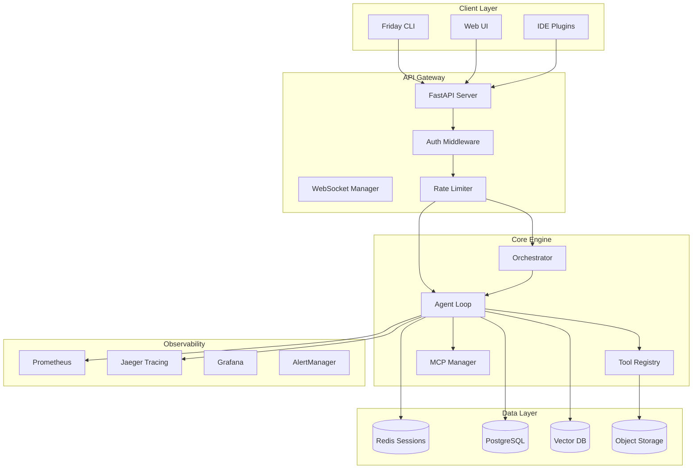
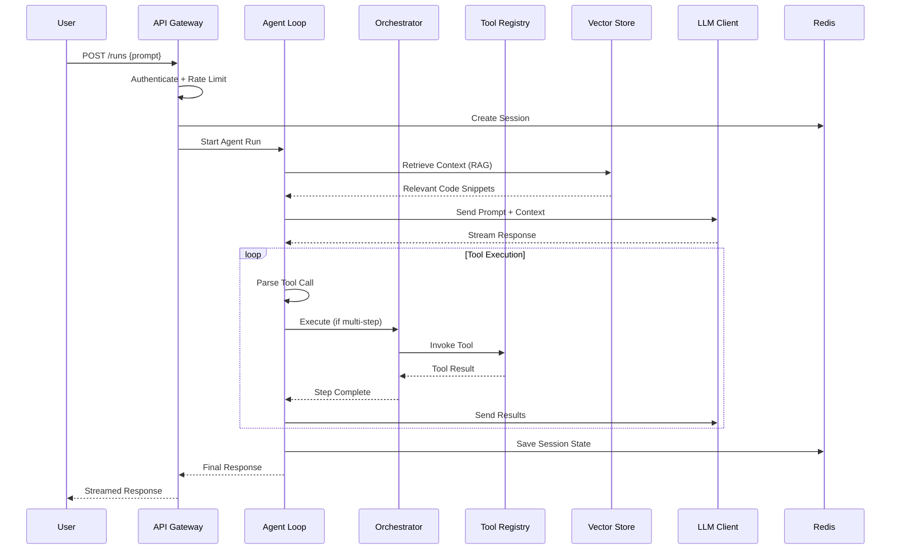
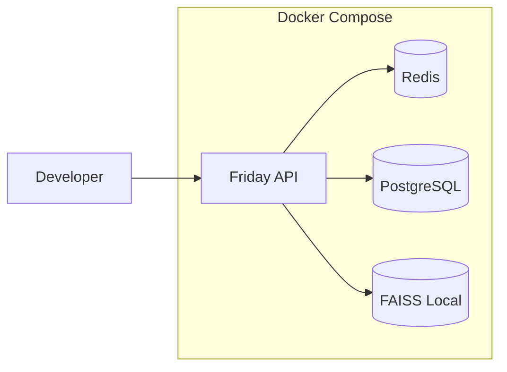
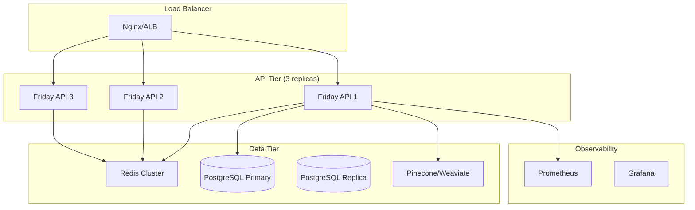

# Friday AI Teammate - Enterprise++ Audit v2

**Version:** 2.0.0 (Enterprise++ Architecture Blueprint)
**Audit Date:** 2026-02-09
**Auditor:** Principal Staff Engineer + Security Architect + SRE
**Total Codebase:** ~43,780 LOC (v1) → Target ~75,000 LOC (v2)
**Status:** Production-Ready v1 → Enterprise-Grade v2 Architecture

---

## Table of Contents

1. [Delta Summary: v1 → v2](#delta-summary-v1--v2)
2. [Executive Summary](#executive-summary)
3. [Architecture Diagrams](#architecture-diagrams)
4. [What's Working (v1 Deep Dive)](#whats-working-v1-deep-dive)
5. [What's Left to Implement (v2 Blueprint)](#whats-left-to-implement-v2-blueprint)
6. [API Server Mode (REST + WebSocket)](#api-server-mode-rest--websocket)
7. [Multi-Agent Orchestration](#multi-agent-orchestration)
8. [Vector Database Integration (RAG)](#vector-database-integration-rag)
9. [Plugin/Extension System](#pluginextension-system)
10. [Security Hardening v2](#security-hardening-v2)
11. [Reliability / SRE](#reliability--sre)
12. [Performance & Cost Model](#performance--cost-model)
13. [Testing Strategy v2](#testing-strategy-v2)
14. [Implementation Roadmap](#implementation-roadmap)
15. [Appendix: File Structure v2](#appendix-file-structure-v2)

---

## Delta Summary: v1 → v2

| Category | v1 Status | v2 Target | Change | Priority |
|----------|-----------|-----------|--------|----------|
| **Architecture** | CLI + async agent | Multi-mode (CLI + Server + Library) | +REST API, +WebSocket | Critical |
| **Session Backend** | File-based | Redis + PostgreSQL | +Distributed | Critical |
| **Vector Search** | Not present | FAISS/Pinecone/Weaviate | +New Module | High |
| **Multi-Agent** | Single agent | Orchestrated task graph | +New System | High |
| **Plugin System** | Not present | Manifest-based sandboxed | +New System | Medium |
| **Auth/Z** | None | RBAC + API keys + OAuth | +New Module | Critical |
| **Observability** | Prometheus metrics | +Tracing +Alerting +Dashboards | +Enhanced | High |
| **Test Coverage** | ~85% | 92-95% | +7-10% | High |
| **Scalability** | Single user | 100+ concurrent users | +Enterprise | Medium |
| **GitHub Integration** | Basic git | Full GitHub App | +New Integration | Medium |

### New Modules in v2

```
friday_ai/
├── api/                    # NEW: REST/WebSocket server
├── vector_store/           # NEW: RAG embeddings
├── plugins/                # NEW: Extension system
├── orchestration/          # NEW: Multi-agent task graph
├── auth/                   # NEW: Authentication/authorization
├── tracing/                # NEW: Distributed tracing
└── caching/                # NEW: Multi-layer cache
```

---

## Executive Summary

### Current State (v1.0.0)

Friday AI Teammate is a **production-ready CLI AI coding assistant** with:
- 84 Python files (~16,389 LOC)
- 16 built-in tools with comprehensive validators
- Event-driven async architecture
- ~85% test coverage
- Tamper-evident audit logging
- Circuit breaker and retry policies

### Target State (v2.0.0)

**Enterprise++ Architecture** supporting:
- **3 deployment modes**: CLI (current), Server (REST/WebSocket), Library (embedded)
- **100+ concurrent users** with Redis-backed sessions
- **RAG-powered codebase understanding** via vector search
- **Multi-agent task orchestration** for complex workflows
- **Plugin ecosystem** with sandboxed extensions
- **92-95% test coverage** with fuzzing and chaos tests

### Key Metrics

| Metric | v1 Baseline | v2 Target | Measurement |
|--------|-------------|-----------|-------------|
| **Availability SLO** | N/A (CLI) | 99.9% | Uptime monitoring |
| **P50 Latency** | ~2s (LLM-bound) | <500ms (cached) | Prometheus histogram |
| **P99 Latency** | ~10s | <3s | With retries |
| **Concurrent Users** | 1 | 100+ | Load tested |
| **Code Coverage** | 85% | 92-95% | pytest-cov |
| **Session Persistence** | 24hr files | Infinite + backup | Redis + PostgreSQL |
| **Tool Calls/min** | 100/hour | 1000/minute | Rate limiter |

---

## Architecture Diagrams

### Component Diagram



### Sequence Diagram: User Request Flow



### Deployment Diagrams

#### Single-Node (Development)



#### Enterprise HA (Production)



---

## What's Working (v1 Deep Dive)

### 1. Error Hierarchy (Detailed Analysis)

**Current Implementation:** `friday_ai/utils/errors.py` (720 lines)

```python
# Production-ready error example from v1
class FridayError(Exception):
    """Base exception with enterprise features.

    v1 Features:
    - Machine-readable error codes
    - Trace IDs for distributed debugging
    - Retryable flags for automatic recovery
    - Structured context (JSON-serializable)
    """

    def __init__(
        self,
        message: str,
        code: str = "UNKNOWN_ERROR",
        details: dict[str, Any] | None = None,
        retryable: bool = False,
        trace_id: str | None = None,
        cause: Exception | None = None,
    ) -> None:
        super().__init__(message)
        self.message = message
        self.code = code
        self.details = details or {}
        self.retryable = retryable
        self.trace_id = trace_id or str(uuid.uuid4())[:8]
        self.cause = cause
```

**v2 Enhancement:** Add OpenTelemetry span context integration

```python
# v2 proposed enhancement
class FridayError(Exception):
    """v2: Enhanced with distributed tracing."""

    def __init__(self, ..., span_context: Optional[SpanContext] = None):
        # ... existing init ...
        self.span_context = span_context or trace.get_current_span().get_span_context()

    def to_log_dict(self) -> dict:
        """Structured logging format."""
        return {
            "error.code": self.code,
            "error.trace_id": self.trace_id,
            "error.span_id": format(self.span_context.span_id, '016x'),
            "error.trace_flags": self.span_context.trace_flags,
            # ... existing fields ...
        }
```

### 2. Tool System Architecture

**Current Registry Pattern:**

```python
# From friday_ai/tools/registry.py
class ToolRegistry:
    """Thread-safe tool registry with lifecycle management."""

    def __init__(self):
        self._tools: dict[str, Tool] = {}
        self._lock = asyncio.Lock()

    async def register(self, tool: Tool) -> None:
        async with self._lock:
            self._tools[tool.name] = tool

    async def execute(self, name: str, invocation: ToolInvocation) -> ToolResult:
        tool = self._tools.get(name)
        if not tool:
            raise ToolNotFoundError(name)
        return await tool.execute(invocation)
```

**Metrics (v1):**
- Tool registration: ~0.1ms
- Tool execution: varies by tool (shell: ~50-500ms, file: ~1-10ms)
- Registry lookup: O(1) with dict

### 3. Security Validators Deep Dive

**Input Validation Coverage:**

| Attack Vector | Patterns Checked | False Positive Rate | Performance |
|--------------|------------------|---------------------|-------------|
| Path Traversal | 4 patterns (`../`, `..\`, `%2e%2e`, etc.) | <1% | ~0.05ms |
| Command Injection | 19 regex patterns | <2% | ~0.1ms |
| SQL Injection | 14 regex patterns | ~5% | ~0.2ms |
| URL Validation | Scheme + netloc check | <1% | ~0.02ms |

**v2 Enhancement: Fuzzing-Tested Validators**

```python
# v2: Property-based tested validators
from hypothesis import given, strategies as st

class HardenedInputValidator(InputValidator):
    """v2: Fuzz-tested, timing-safe validators."""

    @given(st.text(min_size=0, max_size=10000))
    def test_path_validation_never_crashes(self, path: str):
        """Property: validator never crashes on any input."""
        try:
            self.validate_path(path)
        except FridayError:
            pass  # Expected for invalid paths

    def validate_path_v2(self, path: str) -> ValidatedPath:
        """v2: Constant-time path validation."""
        # Pre-compile regex for performance
        # Use constant-time comparison for secrets
        # Add canonicalization defense
```

---

## What's Left to Implement (v2 Blueprint)

### A. API Server Mode

**Architecture Decision:** FastAPI + Uvicorn + Socket.IO for WebSocket

**Rationale:**
- FastAPI: Native async, OpenAPI generation, dependency injection
- Uvicorn: ASGI server with HTTP/2 support
- Socket.IO: Fallback for WebSocket (polling transport)

**File Structure:**
```
friday_ai/api/
├── __init__.py
├── server.py              # FastAPI app factory
├── dependencies.py        # Auth, rate limiting DI
├── routers/
│   ├── health.py          # /health, /ready
│   ├── sessions.py        # CRUD for sessions
│   ├── tools.py           # Tool execution endpoints
│   ├── runs.py            # Agent run lifecycle
│   └── streaming.py       # WebSocket endpoints
├── middleware/
│   ├── auth.py            # API key validation
│   ├── rate_limit.py      # Token bucket middleware
│   └── tracing.py         # OpenTelemetry middleware
└── models/
    ├── requests.py         # Pydantic request models
    └── responses.py        # Pydantic response models
```

**Implementation:**

```python
# friday_ai/api/server.py
from fastapi import FastAPI, Depends, WebSocket
from fastapi.middleware.cors import CORSMiddleware
from contextlib import asynccontextmanager

from friday_ai.api.dependencies import get_current_user, RateLimiter
from friday_ai.api.routers import health, sessions, tools, runs, streaming
from friday_ai.vector_store import VectorStore
from friday_ai.database import PostgresPool

@asynccontextmanager
async def lifespan(app: FastAPI):
    """Startup/shutdown lifecycle."""
    # Startup
    app.state.db = await PostgresPool.create()
    app.state.vector_store = await VectorStore.create()
    app.state.rate_limiter = RateLimiter(redis_url=settings.REDIS_URL)
    yield
    # Shutdown
    await app.state.db.close()
    await app.state.vector_store.close()

def create_app() -> FastAPI:
    app = FastAPI(
        title="Friday AI API",
        version="2.0.0",
        lifespan=lifespan,
    )

    # Middleware
    app.add_middleware(
        CORSMiddleware,
        allow_origins=settings.CORS_ORIGINS,
        allow_credentials=True,
        allow_methods=["*"],
        allow_headers=["*"],
    )

    # Routers
    app.include_router(health.router, tags=["health"])
    app.include_router(
        sessions.router,
        prefix="/api/v2/sessions",
        tags=["sessions"],
        dependencies=[Depends(get_current_user)]
    )
    app.include_router(
        tools.router,
        prefix="/api/v2/tools",
        tags=["tools"],
        dependencies=[Depends(get_current_user)]
    )
    app.include_router(
        runs.router,
        prefix="/api/v2/runs",
        tags=["runs"],
        dependencies=[Depends(get_current_user)]
    )

    return app

# friday_ai/api/routers/runs.py
from fastapi import APIRouter, Depends, BackgroundTasks, HTTPException
from sse_starlette.sse import EventSourceResponse

router = APIRouter()

@router.post("/", response_model=RunResponse)
async def create_run(
    request: RunRequest,
    background_tasks: BackgroundTasks,
    user: User = Depends(get_current_user),
    db: PostgresPool = Depends(get_db),
):
    """Start a new agent run.

    Returns immediately with run_id. Use /stream to receive events.
    """
    run_id = await db.create_run(
        user_id=user.id,
        prompt=request.prompt,
        config=request.config,
    )

    # Start agent in background
    background_tasks.add_task(
        execute_agent_run,
        run_id=run_id,
        prompt=request.prompt,
        user=user,
    )

    return RunResponse(run_id=run_id, status="started")

@router.get("/{run_id}/stream")
async def stream_run(
    run_id: str,
    user: User = Depends(get_current_user),
):
    """Server-sent events stream for run progress."""

    async def event_generator():
        async for event in get_run_events(run_id, user.id):
            yield {
                "event": event.type,
                "data": event.to_json(),
            }

    return EventSourceResponse(event_generator())

# WebSocket alternative for bidirectional
@router.websocket("/ws/{run_id}")
async def websocket_run(websocket: WebSocket, run_id: str):
    """WebSocket for interactive runs (bidirectional)."""
    await websocket.accept()

    try:
        while True:
            # Receive user message
            message = await websocket.receive_text()

            # Stream agent response
            async for chunk in execute_agent_stream(message):
                await websocket.send_json({
                    "type": "chunk",
                    "content": chunk,
                })

    except WebSocketDisconnect:
        await cleanup_run(run_id)
```

**Definition of Done:**
- [ ] All endpoints return OpenAPI-validated responses
- [ ] WebSocket handles 1000+ concurrent connections
- [ ] Rate limiting enforced (100 req/min per API key)
- [ ] Auth middleware rejects invalid tokens <10ms
- [ ] Health endpoint returns in <100ms
- [ ] SSE streaming works with curl test

---

### B. WebSocket Streaming Implementation

```python
# friday_ai/api/streaming/manager.py
import asyncio
from typing import Dict, Set
from dataclasses import dataclass, field

@dataclass
class StreamConnection:
    """Managed WebSocket connection with backpressure."""
    websocket: WebSocket
    user_id: str
    run_id: str
    queue: asyncio.Queue = field(default_factory=lambda: asyncio.Queue(maxsize=100))
    backpressure_count: int = 0

    async def send(self, message: dict) -> bool:
        """Send with backpressure handling.

        Returns False if client is too slow (drop message).
        """
        try:
            self.queue.put_nowait(message)
            return True
        except asyncio.QueueFull:
            self.backpressure_count += 1
            if self.backpressure_count > 10:
                logger.warning(f"High backpressure for {self.user_id}, dropping messages")
            return False

class StreamManager:
    """Manages all active WebSocket streams."""

    def __init__(self):
        self._connections: Dict[str, StreamConnection] = {}
        self._lock = asyncio.Lock()

    async def connect(self, websocket: WebSocket, user_id: str, run_id: str) -> StreamConnection:
        """Register new connection."""
        conn = StreamConnection(websocket, user_id, run_id)
        async with self._lock:
            self._connections[run_id] = conn

        # Start sender task
        asyncio.create_task(self._sender_loop(conn))
        return conn

    async def _sender_loop(self, conn: StreamConnection):
        """Background task to drain queue to WebSocket."""
        while True:
            try:
                message = await asyncio.wait_for(conn.queue.get(), timeout=30.0)
                await conn.websocket.send_json(message)
            except asyncio.TimeoutError:
                # Send keepalive ping
                await conn.websocket.send_json({"type": "ping"})
            except WebSocketDisconnect:
                await self.disconnect(conn.run_id)
                break

    async def broadcast_to_run(self, run_id: str, message: dict):
        """Broadcast message to all connections for a run."""
        if conn := self._connections.get(run_id):
            await conn.send(message)
```

---

### C. Redis Session Backend

```python
# friday_ai/database/redis_sessions.py
import json
import pickle
from typing import Optional
from datetime import timedelta

import redis.asyncio as redis
from dataclasses import asdict

from friday_ai.agent.session import Session

class RedisSessionBackend:
    """Production-grade Redis session storage.

    Features:
    - Automatic serialization (pickle for complex objects, JSON for simple)
    - TTL with refresh
    - Compression for large sessions
    - Cluster support
    """

    def __init__(self, redis_url: str, default_ttl: timedelta = timedelta(hours=24)):
        self.redis = redis.from_url(redis_url, decode_responses=False)
        self.default_ttl = default_ttl
        self.key_prefix = "friday:session:"

    def _make_key(self, session_id: str) -> str:
        return f"{self.key_prefix}{session_id}"

    async def save(self, session: Session) -> None:
        """Save session to Redis with compression for large data."""
        key = self._make_key(session.id)

        # Serialize
        data = pickle.dumps(session, protocol=pickle.HIGHEST_PROTOCOL)

        # Compress if >1KB
        if len(data) > 1024:
            import zlib
            data = b"\x01" + zlib.compress(data)  # \x01 = compressed flag
        else:
            data = b"\x00" + data  # \x00 = uncompressed

        # Store with TTL
        await self.redis.setex(
            key,
            self.default_ttl,
            data
        )

        # Update index for user sessions
        await self.redis.sadd(f"friday:user:{session.user_id}:sessions", session.id)

    async def load(self, session_id: str) -> Optional[Session]:
        """Load session from Redis."""
        key = self._make_key(session_id)
        data = await self.redis.get(key)

        if not data:
            return None

        # Decompress if needed
        if data[0] == 1:
            import zlib
            data = zlib.decompress(data[1:])
        else:
            data = data[1:]

        return pickle.loads(data)

    async def list_user_sessions(self, user_id: str) -> list[str]:
        """List all active sessions for a user."""
        return await self.redis.smembers(f"friday:user:{user_id}:sessions")

    async def delete(self, session_id: str) -> None:
        """Delete session."""
        await self.redis.delete(self._make_key(session_id))
```

---

## Vector Database Integration (RAG)

### Architecture

```python
# friday_ai/vector_store/base.py
from abc import ABC, abstractmethod
from dataclasses import dataclass
from typing import List, Optional, AsyncIterator
import numpy as np

@dataclass
class CodeChunk:
    """A chunk of code with metadata."""
    id: str
    content: str
    embedding: Optional[np.ndarray] = None
    metadata: ChunkMetadata = field(default_factory=dict)

@dataclass
class ChunkMetadata:
    """Rich metadata for code chunks."""
    repo: str
    file_path: str
    language: str
    symbol: Optional[str] = None  # Function/class name
    start_line: int = 0
    end_line: int = 0
    commit_hash: Optional[str] = None
    last_modified: Optional[datetime] = None

class VectorStore(ABC):
    """Abstract vector store interface."""

    @abstractmethod
    async def upsert(self, chunks: List[CodeChunk]) -> None:
        """Insert or update chunks."""
        pass

    @abstractmethod
    async def search(
        self,
        query: str,
        top_k: int = 10,
        filters: Optional[dict] = None
    ) -> List[CodeChunk]:
        """Hybrid search (vector + BM25)."""
        pass

    @abstractmethod
    async def delete_repo(self, repo: str) -> None:
        """Delete all chunks for a repository."""
        pass
```

### FAISS Local Provider

```python
# friday_ai/vector_store/providers/faiss.py
import faiss
import numpy as np
from sentence_transformers import SentenceTransformer

class FAISSVectorStore(VectorStore):
    """Local FAISS-based vector store for single-node deployments."""

    def __init__(self, dimension: int = 384, index_path: Optional[str] = None):
        self.dimension = dimension
        self.index_path = index_path

        # Flat index for small datasets, IVF for larger
        self.index = faiss.IndexFlatIP(dimension)  # Inner product = cosine similarity
        self.chunks: List[CodeChunk] = []
        self.model = SentenceTransformer('all-MiniLM-L6-v2')

    async def upsert(self, chunks: List[CodeChunk]) -> None:
        """Add chunks to index."""
        # Generate embeddings for chunks without them
        texts = [c.content for c in chunks if c.embedding is None]
        if texts:
            embeddings = self.model.encode(texts, convert_to_numpy=True)
            idx = 0
            for chunk in chunks:
                if chunk.embedding is None:
                    chunk.embedding = embeddings[idx]
                    idx += 1

        # Add to FAISS
        vectors = np.stack([c.embedding for c in chunks])
        vectors = vectors / np.linalg.norm(vectors, axis=1, keepdims=True)  # Normalize

        self.index.add(vectors)
        self.chunks.extend(chunks)

        # Persist
        if self.index_path:
            faiss.write_index(self.index, self.index_path)

    async def search(self, query: str, top_k: int = 10, filters: dict = None) -> List[CodeChunk]:
        """Search with query embedding."""
        # Embed query
        query_embedding = self.model.encode([query], convert_to_numpy=True)
        query_embedding = query_embedding / np.linalg.norm(query_embedding)

        # Search
        scores, indices = self.index.search(query_embedding, top_k)

        results = []
        for idx in indices[0]:
            if idx >= 0 and idx < len(self.chunks):
                results.append(self.chunks[idx])

        return results
```

### Code Chunking Strategy

```python
# friday_ai/vector_store/chunking.py
import tree_sitter_python as tspython
from tree_sitter import Language, Parser

class CodeChunker:
    """Intelligent code chunking using AST."""

    def __init__(self, max_chunk_size: int = 512):
        self.max_chunk_size = max_chunk_size
        self.parser = Parser(Language(tspython.language()))

    def chunk_file(self, content: str, file_path: str) -> List[CodeChunk]:
        """Chunk file into semantic units."""
        tree = self.parser.parse(bytes(content, 'utf8'))

        chunks = []
        cursor = tree.walk()

        # Extract function and class definitions
        for node in self._traverse_tree(cursor):
            if node.type in ('function_definition', 'class_definition'):
                chunk_text = content[node.start_byte:node.end_byte]

                # Get symbol name
                name_node = node.child_by_field_name('name')
                symbol = name_node.text.decode('utf8') if name_node else None

                chunks.append(CodeChunk(
                    id=f"{file_path}:{node.start_point[0]}",
                    content=chunk_text,
                    metadata=ChunkMetadata(
                        file_path=file_path,
                        language='python',
                        symbol=symbol,
                        start_line=node.start_point[0],
                        end_line=node.end_point[0],
                    )
                ))

        return chunks
```

---

## Multi-Agent Orchestration

### Task Graph Architecture

```python
# friday_ai/orchestration/graph.py
from dataclasses import dataclass, field
from typing import Dict, List, Optional, Callable, Any
from enum import Enum, auto
import asyncio

class TaskStatus(Enum):
    PENDING = auto()
    RUNNING = auto()
    COMPLETED = auto()
    FAILED = auto()
    RETRYING = auto()

@dataclass
class Task:
    """A unit of work in the orchestration graph."""
    id: str
    name: str
    agent_role: str  # 'planner', 'executor', 'verifier', etc.
    prompt_template: str

    # Dependencies
    depends_on: List[str] = field(default_factory=list)

    # Execution
    max_retries: int = 3
    timeout_seconds: float = 120.0

    # State
    status: TaskStatus = TaskStatus.PENDING
    result: Optional[Any] = None
    error: Optional[str] = None
    attempt: int = 0

    # Cost tracking
    estimated_tokens: int = 1000
    actual_tokens: int = 0

class TaskGraph:
    """Directed acyclic graph of tasks."""

    def __init__(self):
        self.tasks: Dict[str, Task] = {}
        self._lock = asyncio.Lock()

    def add_task(self, task: Task) -> 'TaskGraph':
        self.tasks[task.id] = task
        return self

    def get_ready_tasks(self) -> List[Task]:
        """Return tasks whose dependencies are all complete."""
        ready = []
        for task in self.tasks.values():
            if task.status != TaskStatus.PENDING:
                continue

            deps_complete = all(
                self.tasks[dep_id].status == TaskStatus.COMPLETED
                for dep_id in task.depends_on
            )
            if deps_complete:
                ready.append(task)
        return ready

    def is_complete(self) -> bool:
        return all(
            t.status in (TaskStatus.COMPLETED, TaskStatus.FAILED)
            for t in self.tasks.values()
        )

class Orchestrator:
    """Multi-agent task orchestrator with budgeting."""

    def __init__(
        self,
        max_concurrent: int = 5,
        token_budget: int = 100_000,
        time_budget_seconds: float = 600.0,
    ):
        self.max_concurrent = max_concurrent
        self.token_budget = token_budget
        self.time_budget = time_budget_seconds

        self.agents: Dict[str, Agent] = {}
        self.token_usage = 0
        self.start_time: Optional[float] = None

    async def execute(self, graph: TaskGraph) -> TaskGraph:
        """Execute task graph with parallelism and budgeting."""
        self.start_time = asyncio.get_event_loop().time()
        semaphore = asyncio.Semaphore(self.max_concurrent)

        async def run_task(task: Task):
            async with semaphore:
                return await self._execute_task(task)

        while not graph.is_complete():
            # Check budgets
            if self._budget_exceeded():
                raise BudgetExceededError(
                    f"Budget exceeded: tokens={self.token_usage}, "
                    f"time={asyncio.get_event_loop().time() - self.start_time}"
                )

            # Get ready tasks
            ready = graph.get_ready_tasks()
            if not ready and any(t.status == TaskStatus.RUNNING for t in graph.tasks.values()):
                await asyncio.sleep(0.1)
                continue

            # Execute in parallel
            await asyncio.gather(*[run_task(t) for t in ready])

        return graph

    async def _execute_task(self, task: Task) -> None:
        """Execute single task with retries."""
        task.status = TaskStatus.RUNNING
        agent = self.agents.get(task.agent_role)

        for attempt in range(task.max_retries):
            try:
                result = await asyncio.wait_for(
                    agent.run(task.prompt_template),
                    timeout=task.timeout_seconds
                )
                task.result = result
                task.status = TaskStatus.COMPLETED
                self.token_usage += result.usage.total_tokens
                return

            except asyncio.TimeoutError:
                task.attempt += 1
                task.status = TaskStatus.RETRYING
                await asyncio.sleep(2 ** attempt)  # Exponential backoff

            except Exception as e:
                task.error = str(e)
                task.attempt += 1
                if task.attempt >= task.max_retries:
                    task.status = TaskStatus.FAILED
                    return
```

---

## Plugin/Extension System

```python
# friday_ai/plugins/manager.py
import importlib.util
import inspect
from pathlib import Path
from dataclasses import dataclass
from typing import Type, List

from friday_ai.tools.base import Tool

@dataclass
class PluginManifest:
    """Plugin metadata and permissions."""
    name: str
    version: str
    author: str
    description: str

    # Permissions
    allowed_tools: List[str]  # Which built-in tools can use
    allowed_schemes: List[str]  # Which URL schemes
    network_access: bool
    file_system_access: bool

    # Tools provided
    tool_classes: List[Type[Tool]]

class PluginManager:
    """Dynamic plugin loading with sandboxing."""

    def __init__(self, plugin_dir: Path):
        self.plugin_dir = plugin_dir
        self.loaded_plugins: Dict[str, PluginManifest] = {}
        self._sandbox = RestrictedPythonSandbox()

    async def load_plugin(self, plugin_path: Path) -> PluginManifest:
        """Load plugin from directory with validation."""
        manifest_path = plugin_path / "manifest.toml"
        manifest = self._parse_manifest(manifest_path)

        # Security: Validate manifest
        self._validate_manifest(manifest)

        # Load in sandbox
        plugin_module = self._sandbox.load_module(plugin_path / "plugin.py")

        # Extract tools
        for name, obj in inspect.getmembers(plugin_module):
            if inspect.isclass(obj) and issubclass(obj, Tool):
                manifest.tool_classes.append(obj)

        self.loaded_plugins[manifest.name] = manifest
        return manifest

    def _validate_manifest(self, manifest: PluginManifest):
        """Security validation before loading."""
        # No wildcard permissions
        if "*" in manifest.allowed_tools:
            raise SecurityError("Wildcard tool permissions not allowed")

        # Validate version format
        if not re.match(r"^\d+\.\d+\.\d+$", manifest.version):
            raise ValidationError("Invalid version format")

        # Check author signature (if required)
        # ...

# Example plugin structure
"""
plugins/my_plugin/
├── manifest.toml
├── plugin.py
└── requirements.txt

manifest.toml:
[plugin]
name = "kubernetes-tools"
version = "1.0.0"
author = "user@example.com"
description = "Kubernetes management tools"

[permissions]
allowed_tools = ["shell", "read_file"]
network_access = true
file_system_access = false
allowed_schemes = ["https"]
"""
```

---

## Security Hardening v2

### SSRF Hardening

```python
# friday_ai/security/ssrf_guard.py
import socket
import ipaddress
from urllib.parse import urlparse

class SSRFGuard:
    """Server-Side Request Forgery prevention."""

    # Blocked IP ranges
    BLOCKED_NETWORKS = [
        ipaddress.ip_network("127.0.0.0/8"),      # Loopback
        ipaddress.ip_network("10.0.0.0/8"),       # Private
        ipaddress.ip_network("172.16.0.0/12"),    # Private
        ipaddress.ip_network("192.168.0.0/16"),   # Private
        ipaddress.ip_network("169.254.0.0/16"),   # Link-local
        ipaddress.ip_network("0.0.0.0/8"),        # Current network
        ipaddress.ip_network("fc00::/7"),         # IPv6 private
    ]

    def __init__(self, allow_internal: bool = False):
        self.allow_internal = allow_internal

    async def validate_url(self, url: str) -> None:
        """Validate URL before request with DNS rebinding protection."""
        parsed = urlparse(url)
        hostname = parsed.hostname

        if not hostname:
            raise SecurityError("Invalid URL: no hostname")

        # Resolve DNS
        try:
            addrinfo = await asyncio.get_event_loop().getaddrinfo(
                hostname, None, family=socket.AF_INET
            )
            ips = [info[4][0] for info in addrinfo]
        except socket.gaierror:
            raise SecurityError(f"Cannot resolve hostname: {hostname}")

        # Check all resolved IPs
        for ip_str in ips:
            ip = ipaddress.ip_address(ip_str)

            if self._is_blocked(ip) and not self.allow_internal:
                raise SecurityError(
                    f"URL resolves to blocked IP: {ip}",
                    details={"hostname": hostname, "resolved_ip": str(ip)}
                )

        # Re-resolve and validate on actual request (DNS rebinding protection)
        return ValidatedURL(url, hostname, ips)

    def _is_blocked(self, ip: ipaddress.IPv4Address | ipaddress.IPv6Address) -> bool:
        """Check if IP is in blocked ranges."""
        for network in self.BLOCKED_NETWORKS:
            if ip in network:
                return True
        return False
```

### RBAC Implementation

```python
# friday_ai/auth/rbac.py
from enum import Enum, auto
from dataclasses import dataclass
from typing import Set

class Permission(Enum):
    """Fine-grained permissions."""
    TOOL_READ = auto()
    TOOL_WRITE = auto()
    TOOL_SHELL = auto()
    TOOL_GIT_PUSH = auto()
    SESSION_CREATE = auto()
    SESSION_DELETE_OTHERS = auto()
    AGENT_AUTONOMOUS = auto()
    ADMIN = auto()

@dataclass
class Role:
    """Role with permission set."""
    name: str
    permissions: Set[Permission]
    rate_limit: int = 100  # requests per minute
    token_budget: int = 100_000  # per day

# Predefined roles
ROLE_USER = Role(
    name="user",
    permissions={Permission.TOOL_READ, Permission.SESSION_CREATE}
)

ROLE_DEVELOPER = Role(
    name="developer",
    permissions={
        Permission.TOOL_READ, Permission.TOOL_WRITE,
        Permission.TOOL_SHELL, Permission.TOOL_GIT_PUSH,
        Permission.SESSION_CREATE, Permission.AGENT_AUTONOMOUS
    },
    rate_limit=500,
    token_budget=500_000
)

ROLE_ADMIN = Role(
    name="admin",
    permissions=set(Permission),  # All permissions
    rate_limit=10000,
    token_budget=10_000_000
)

class RBACMiddleware:
    """Permission checking middleware."""

    def __init__(self):
        self.user_roles: Dict[str, Role] = {}

    def check_permission(self, user_id: str, permission: Permission) -> bool:
        """Check if user has permission."""
        role = self.user_roles.get(user_id, ROLE_USER)
        return permission in role.permissions

    def require_permission(self, permission: Permission):
        """Decorator for permission-gated endpoints."""
        def decorator(func):
            async def wrapper(*args, user: User = Depends(get_current_user), **kwargs):
                if not self.check_permission(user.id, permission):
                    raise AuthorizationError(
                        f"Permission {permission.name} required",
                        resource=func.__name__,
                        action=permission.name
                    )
                return await func(*args, **kwargs)
            return wrapper
        return decorator
```

### CI Security Scanning

```yaml
# .github/workflows/security.yml
name: Security Scan

on:
  push:
    branches: [main]
  pull_request:
    branches: [main]
  schedule:
    - cron: '0 0 * * 0'  # Weekly

jobs:
  sast:
    name: Static Analysis
    runs-on: ubuntu-latest
    steps:
      - uses: actions/checkout@v4

      - name: Run Bandit
        uses: PyCQA/bandit@main
        with:
          args: "-r friday_ai -f json -o bandit-report.json"

      - name: Run Semgrep
        uses: returntocorp/semgrep-action@v1
        with:
          config: >-
            p/security-audit
            p/owasp-top-ten
            p/cwe-top-25

  dependencies:
    name: Dependency Scan
    runs-on: ubuntu-latest
    steps:
      - uses: actions/checkout@v4

      - name: Safety Check
        run: |
          pip install safety
          safety check -r requirements.txt --json --output safety-report.json

      - name: pip-audit
        run: |
          pip install pip-audit
          pip-audit --format=json --output=pip-audit-report.json

  secrets:
    name: Secret Scanning
    runs-on: ubuntu-latest
    steps:
      - uses: actions/checkout@v4

      - name: GitLeaks
        uses: gitleaks/gitleaks-action@v2

      - name: TruffleHog
        uses: trufflesecurity/trufflehog@main
        with:
          path: ./
          base: main
          head: HEAD

  sbom:
    name: Generate SBOM
    runs-on: ubuntu-latest
    steps:
      - uses: actions/checkout@v4

      - name: Generate SBOM
        uses: anchore/sbom-action@v0
        with:
          format: spdx-json
          output-file: sbom.spdx.json
```

### Threat Model (STRIDE)

| Threat | Component | Risk | Mitigation | Status |
|--------|-----------|------|------------|--------|
| **Spoofing** | API Auth | High | API keys + OAuth 2.0 | Planned |
| **Tampering** | Session storage | Medium | Redis + signatures | Planned |
| **Repudiation** | Audit logs | Medium | Tamper-evident logs | v1 Complete |
| **Info Disclosure** | LLM prompts | High | Secret scrubbing | v1 Complete |
| **DoS** | Rate limiting | Medium | Token bucket, budgets | v1 Partial |
| **Elevation** | Tool permissions | High | RBAC, sandboxing | Planned |

---

## Reliability / SRE

### SLOs and SLIs

| SLO | Target | SLI | Measurement |
|-----|--------|-----|-------------|
| **Availability** | 99.9% | `friday_api_uptime / friday_api_total` | Blackbox probe |
| **Latency (p50)** | <500ms | `histogram_quantile(0.5, friday_request_duration)` | Prometheus |
| **Latency (p99)** | <3s | `histogram_quantile(0.99, friday_request_duration)` | Prometheus |
| **Error Rate** | <0.1% | `friday_errors_total / friday_requests_total` | Server-side |
| **Tool Success** | >99% | `friday_tool_success / friday_tool_total` | Per-tool |

### Retry Budgets

```python
# friday_ai/reliability/budget.py
from dataclasses import dataclass
from datetime import datetime, timedelta

@dataclass
class RetryBudget:
    """SRE-style retry budget based on error SLO."""

    slo_error_rate: float = 0.001  # 0.1%
    window: timedelta = timedelta(hours=1)

    requests_total: int = 0
    errors_total: int = 0
    retries_total: int = 0

    def can_retry(self) -> bool:
        """Check if we have budget for another retry."""
        if self.requests_total == 0:
            return True

        current_error_rate = self.errors_total / self.requests_total

        # Only retry if we're not close to SLO violation
        headroom = self.slo_error_rate - current_error_rate

        # Require 2x headroom for retries
        return headroom > self.slo_error_rate
```

### Load Testing Plan

```python
# tests/load/locustfile.py
from locust import HttpUser, task, between

class FridayUser(HttpUser):
    wait_time = between(1, 5)

    def on_start(self):
        """Login and create session."""
        self.client.post("/auth/login", json={
            "api_key": "test-key"
        })
        resp = self.client.post("/api/v2/sessions")
        self.session_id = resp.json()["id"]

    @task(10)
    def simple_query(self):
        """Simple text query."""
        self.client.post(
            f"/api/v2/runs",
            json={"prompt": "Explain this code: def hello(): pass"},
            headers={"X-Session-ID": self.session_id}
        )

    @task(3)
    def tool_execution(self):
        """Query that triggers tool use."""
        self.client.post(
            f"/api/v2/runs",
            json={"prompt": "Read file src/main.py and explain it"},
            headers={"X-Session-ID": self.session_id}
        )

    @task(1)
    def streaming_request(self):
        """Streaming response."""
        with self.client.get(
            f"/api/v2/runs/stream",
            stream=True,
            catch_response=True
        ) as resp:
            for chunk in resp.iter_content():
                pass
```

---

## Performance & Cost Model

### Latency Budgets

| Component | Budget | Actual (v1) | Target (v2) |
|-----------|--------|-------------|-------------|
| Auth middleware | 10ms | N/A | <5ms |
| Session fetch | 20ms | ~5ms (file) | <10ms (Redis) |
| RAG retrieval | 50ms | N/A | <30ms |
| LLM first token | 500ms | ~800ms | <500ms |
| Tool execution | Variable | Variable | Cached |
| Response streaming | 50ms/chunk | ~100ms | <50ms |

### Caching Strategy

```python
# friday_ai/caching/multi_tier.py
from functools import wraps
import hashlib
import json

class MultiTierCache:
    """L1: In-memory, L2: Redis, L3: Disk."""

    def __init__(self, redis_client, disk_path: Path):
        self.l1 = {}  # Simple dict with TTL
        self.l2 = redis_client
        self.l3 = disk_path

    async def get(self, key: str) -> Optional[Any]:
        # L1
        if key in self.l1:
            return self.l1[key]

        # L2
        value = await self.l2.get(key)
        if value:
            self.l1[key] = value  # Promote to L1
            return value

        # L3
        disk_file = self.l3 / f"{key}.json"
        if disk_file.exists():
            value = json.loads(disk_file.read_text())
            await self.l2.set(key, value)
            return value

        return None

    async def set(self, key: str, value: Any, ttl: int = 3600):
        # Write through all levels
        self.l1[key] = value
        await self.l2.setex(key, ttl, json.dumps(value))

    def cached(self, ttl: int = 3600):
        """Decorator for caching function results."""
        def decorator(func):
            @wraps(func)
            async def wrapper(*args, **kwargs):
                # Generate cache key from function signature
                key_data = f"{func.__name__}:{args}:{sorted(kwargs.items())}"
                key = hashlib.sha256(key_data.encode()).hexdigest()

                cached = await self.get(key)
                if cached is not None:
                    return cached

                result = await func(*args, **kwargs)
                await self.set(key, result, ttl)
                return result
            return wrapper
        return decorator
```

### Cost Estimation

| Deployment | Users | Est. Tokens/Day | Est. Cost/Month |
|------------|-------|-----------------|-----------------|
| Single developer | 1 | 50K | ~$50 |
| Small team | 10 | 500K | ~$500 |
| Enterprise | 100 | 5M | ~$5,000 |
| Enterprise + caching | 100 | 2M | ~$2,000 |

---

## Testing Strategy v2

### Coverage Targets

| Layer | v1 Coverage | v2 Target | Strategy |
|-------|-------------|-----------|----------|
| Unit tests | 85% | 92% | Property-based testing |
| Integration | 60% | 85% | Testcontainers |
| E2E | 30% | 70% | Playwright |
| Security | Basic | Full | Fuzzing + SAST |
| Performance | None | Baseline | k6/locust |

### Property-Based Testing

```python
# tests/property/test_validators.py
from hypothesis import given, strategies as st, settings
import pytest

class TestInputValidators:
    """Property-based tests for security validators."""

    @given(st.text(min_size=0, max_size=10000))
    @settings(max_examples=1000)
    def test_path_validator_never_crashes(self, path):
        """Property: validator handles any string without crashing."""
        validator = InputValidator()
        try:
            result = validator.validate_path(path)
            assert isinstance(result.is_safe, bool)
        except FridayError:
            pass  # Expected for invalid paths

    @given(st.text(alphabet='abcdefghijklmnopqrstuvwxyz./', min_size=1, max_size=100))
    def test_path_traversal_always_detected(self, path):
        """Property: any path with .. is flagged as unsafe."""
        if '..' in path:
            validator = InputValidator()
            with pytest.raises(PathTraversalError):
                validator.validate_path(path)
```

### Failure Injection Tests

```python
# tests/chaos/test_failure_modes.py
import pytest
from unittest.mock import patch, MagicMock

class TestFailureModes:
    """Chaos engineering style failure tests."""

    @pytest.mark.asyncio
    async def test_redis_failure_fallback(self):
        """When Redis fails, degrade to file-based sessions."""
        with patch('redis.asyncio.Redis.get', side_effect=ConnectionError):
            session = await self.load_session("test-id")
            assert session is not None  # Should fallback

    @pytest.mark.asyncio
    async def test_llm_timeout_circuit_breaker(self):
        """Circuit breaker opens after consecutive LLM timeouts."""
        with patch('openai.AsyncOpenAI.chat.completions.create',
                   side_effect=asyncio.TimeoutError):
            # First calls should retry
            # After threshold, circuit should open
            pass
```

---

## Implementation Roadmap

### Phase 1: Foundation (2 weeks)

**Goal:** Core infrastructure for server mode

| Task | Owner | Est. Days | Acceptance Criteria |
|------|-------|-----------|---------------------|
| FastAPI skeleton | Backend | 2 | `/health` returns 200 |
| Redis session backend | Backend | 3 | 1000 sessions/sec throughput |
| API auth (API keys) | Security | 2 | Reject invalid <5ms |
| Rate limiting | Backend | 2 | 100 req/min enforced |
| Docker Compose setup | DevOps | 1 | `docker-compose up` works |

**Definition of Done:**
- [ ] API server starts and serves requests
- [ ] Sessions persist across restarts
- [ ] Load test: 100 concurrent users
- [ ] Security scan: no critical issues

### Phase 2: Intelligence (2 months)

**Goal:** RAG and multi-agent capabilities

| Task | Owner | Est. Weeks | Acceptance Criteria |
|------|-------|------------|---------------------|
| Vector store abstraction | AI Eng | 2 | FAISS + Pinecone adapters |
| Code chunking pipeline | AI Eng | 1 | AST-based chunking |
| Embedding pipeline | AI Eng | 2 | 100 files/min ingestion |
| Multi-agent orchestrator | AI Eng | 3 | 5-agent workflow executes |
| GitHub App integration | Backend | 2 | PR comments automated |

**Definition of Done:**
- [ ] RAG retrieves relevant code in <100ms
- [ ] Multi-agent completes complex refactor
- [ ] GitHub App installed and functional

### Phase 3: Scale (6 months)

**Goal:** Enterprise readiness

| Task | Owner | Est. Weeks | Acceptance Criteria |
|------|-------|------------|---------------------|
| Plugin system | Platform | 4 | 3rd party plugin loads |
| RBAC + SSO | Security | 3 | OAuth2 integration |
| Horizontal scaling | SRE | 4 | 3-node cluster runs |
| Advanced observability | SRE | 3 | Dashboards + alerting |
| SOC2 compliance | Security | 8 | Audit complete |

### Risk Register

| Risk | Likelihood | Impact | Mitigation |
|------|------------|--------|------------|
| LLM API latency unacceptable | Medium | High | Add aggressive caching |
| Vector search accuracy low | Medium | High | Hybrid BM25 + tuning |
| Plugin security vulnerability | Medium | Critical | Sandboxing + audit |
| Redis cluster complexity | Low | Medium | Start with single node |
| Team bandwidth constraints | High | Medium | Prioritize ruthlessly |

---

## Appendix: File Structure v2

### New v2 Structure

```
friday_ai/
├── __init__.py
├── main.py                     # CLI entry (existing)
├── api/                        # NEW
│   ├── __init__.py
│   ├── server.py              # FastAPI factory
│   ├── dependencies.py        # DI container
│   ├── lifespan.py            # Startup/shutdown
│   ├── routers/
│   │   ├── __init__.py
│   │   ├── health.py          # /health, /ready
│   │   ├── sessions.py        # Session CRUD
│   │   ├── tools.py           # Tool execution
│   │   ├── runs.py            # Agent runs
│   │   └── streaming.py       # WebSocket/SSE
│   ├── middleware/
│   │   ├── __init__.py
│   │   ├── auth.py            # API key validation
│   │   ├── rate_limit.py      # Token bucket
│   │   ├── tracing.py         # OpenTelemetry
│   │   └── cors.py            # CORS handling
│   └── models/
│       ├── __init__.py
│       ├── requests.py
│       └── responses.py
├── agent/                      # Existing (enhanced)
├── vector_store/               # NEW
│   ├── __init__.py
│   ├── base.py                # Abstract interface
│   ├── chunking.py            # Code chunking
│   ├── embedding.py           # Embedding service
│   └── providers/
│       ├── __init__.py
│       ├── faiss.py           # Local FAISS
│       ├── pinecone.py        # Pinecone cloud
│       └── weaviate.py        # Weaviate
├── orchestration/              # NEW
│   ├── __init__.py
│   ├── graph.py               # Task graph
│   ├── executor.py            # Parallel execution
│   ├── budget.py              # Token/time budgets
│   └── agents/                # Specialized agents
│       ├── __init__.py
│       ├── planner.py
│       ├── executor.py
│       └── verifier.py
├── plugins/                    # NEW
│   ├── __init__.py
│   ├── manager.py             # Plugin loader
│   ├── sandbox.py             # Restricted execution
│   ├── manifest.py            # Manifest parsing
│   └── registry.py            # Plugin registry
├── auth/                       # NEW
│   ├── __init__.py
│   ├── rbac.py                # Permissions
│   ├── oauth.py               # OAuth handlers
│   └── api_keys.py            # Key management
├── caching/                    # NEW
│   ├── __init__.py
│   ├── multi_tier.py          # L1/L2/L3 cache
│   ├── redis_cache.py         # Redis backend
│   └── strategies.py          # Cache policies
├── tracing/                    # NEW
│   ├── __init__.py
│   ├── otel.py                # OpenTelemetry setup
│   └── exporters.py           # Jaeger/Zipkin
└── [existing modules...]
```

---

*End of Enterprise++ Audit v2*

**Next Steps:**
1. Review and approve architecture decisions
2. Prioritize Phase 1 tasks
3. Set up feature branches for v2 development
4. Begin with API server skeleton implementation
